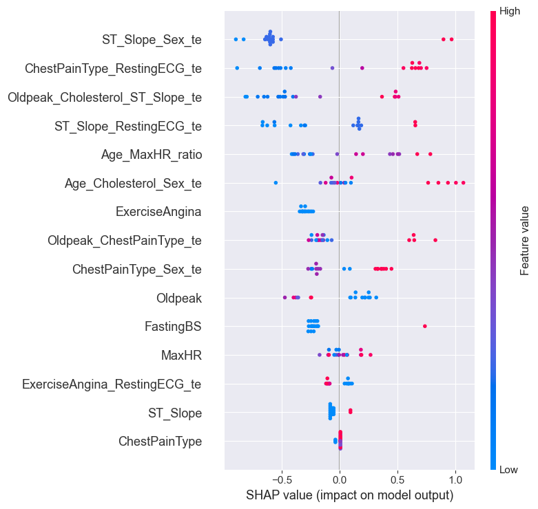

# Unaccounted diseases outside the conjunctive_rules feature

The conjunctive_rules feature covers many diseases, but there are 18 unaccounted cases. It would be interesting
to understand the circumstances under which they occur. Perhaps there are combinations I may have missed.

Original features and probabilities predicted by the model:

|    | Age | Sex | CPT | RestingBP | Cholesterol | FBS | RECG   | MaxHR | ExAngina | Oldpeak | ST_Slope | 1_proba  |
|----|-----|-----|-----|-----------|-------------|-----|--------|-------|----------|---------|----------|----------|
| 1  | 44  | M   | ASY | 112.0     | 290.0       | 0   | LVH    | 153   | N        | 0.0     | Up       | 0.316968 |
| 2  | 57  | M   | ATA | 124.0     | 261.0       | 0   | Normal | 141   | N        | 0.3     | Up       | 0.087812 |
| 3  | 44  | M   | ASY | 110.0     | 197.0       | 0   | LVH    | 177   | N        | 0.0     | Up       | 0.352428 |
| 4  | 34  | M   | TA  | 140.0     | 156.0       | 0   | Normal | 180   | N        | 0.0     | Flat     | 0.800278 |
| 5  | 49  | M   | NAP | 118.0     | 149.0       | 0   | LVH    | 126   | N        | 0.8     | Up       | 0.080709 |
| 6  | 55  | M   | ASY | 120.0     | 228.0       | 0   | ST     | 92    | N        | 0.3     | Up       | 0.557811 |
| 7  | 47  | M   | NAP | 108.0     | 243.0       | 0   | Normal | 152   | N        | 0.0     | Up       | 0.029624 |
| 8  | 52  | M   | ASY | 125.0     | 212.0       | 0   | Normal | 168   | N        | 1.0     | Up       | 0.789731 |
| 9  | 43  | M   | ASY | 122.0     | 237.0       | 0   | Normal | 120   | N        | 0.5     | Up       | 0.556851 |
| 10 | 73  | F   | NAP | 160.0     | 269.0       | 0   | ST     | 121   | N        | 0.0     | Up       | 0.144321 |
| 11 | 64  | M   | NAP | 140.0     | 335.0       | 0   | Normal | 158   | N        | 0.0     | Up       | 0.276882 |
| 12 | 54  | M   | ATA | 192.0     | 283.0       | 0   | LVH    | 195   | N        | 0.0     | Up       | 0.061498 |
| 13 | 58  | F   | ATA | 136.0     | 319.0       | 1   | LVH    | 152   | N        | 0.0     | Up       | 0.297536 |
| 14 | 49  | M   | NAP | 115.0     | 265.0       | 0   | Normal | 175   | N        | 0.0     | Flat     | 0.693254 |
| 15 | 59  | M   | TA  | 160.0     | 273.0       | 0   | LVH    | 125   | N        | 0.0     | Up       | 0.266953 |
| 16 | 58  | M   | ASY | 116.0     | 230.0       | 0   | Normal | 124   | N        | 1.0     | Up       | 0.681563 |
| 17 | 40  | M   | ASY | 152.0     | 223.0       | 0   | Normal | 181   | N        | 0.0     | Up       | 0.133636 |
| 18 | 46  | M   | ASY | 120.0     | 249.0       | 0   | LVH    | 144   | N        | 0.8     | Up       | 0.603498 |

1. Age, RestingBP, Cholesterol, and MaxHR vary from low to high, with no dominant group.
2. CPT: NAP is slightly more common than usually.
3. FastingBS is predominantly 0.
4. RestingECG: LVH as common as Normal.
5. ExerciseAngina is predominantly N.
6. Oldpeak is mostly 0, the rest are less than or equal to 1.
7. ST_Slope is predominantly Up.

- Points usually indicating the absence of disease: 5, 6, 7.
- Points indicating the presence of disease 50/50: 2 (due to a mixture of "strong" ASY and "weak" NAP), 3, 4.

Without taking into account model predictions, it's difficult to determine which specific relationships are lost.

The table below shows the predict probability ranges and the cases that fall within them.

| Proba_range | Cases               |
|-------------|---------------------|
| [0.,0.25]   | 2, 5, 7, 10, 12, 17 |
| (0.25,0.5]  | 1, 3, 11, 13, 15    |
| (0.5,0.75]  | 6, 9, 14, 16, 18    |
| (0.75,1]    | 4, 8                |

A third of cases are still classified very close to class 0 in percentage terms. These cases are characterized 
(in the majority) by the following:
- CPT != ASY (otherwise, the remaining features are within the normal range);
- ST_Slope = Up;

The figure shows the SHAP interpretation for these cases:

Which cross-features that could have a big impact aren't in the "rules"?
- ST_Slope & Sex;
- CPT & RestingECG;
- Age & Cholesterol & Sex;
- ST_Slope & RestingECG.

These features are related to either Sex or RestingECG, which weren't fully considered at the initial stage,
and these rules weren't included in the baseline.

That is, there are unaccounted dependencies, but not all cases are separable.
