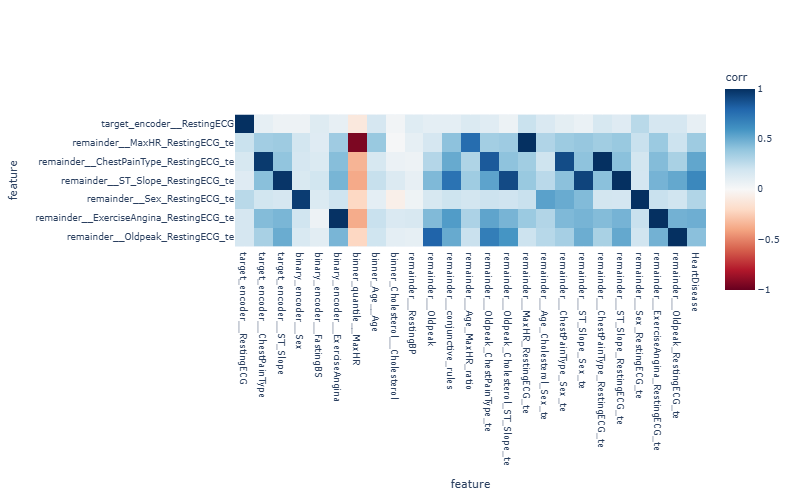

# RestingECG cross features

I tried adding cross-features with RestingECG.

Overall, they correlate well with the target. However, they also repeat information from 
other features (paired in the combination). For VIF the removal order is as follows:

| Feature                                 | VIF        |
|-----------------------------------------|------------|
| remainder__ExerciseAngina_RestingECG_te | 756.713580 |
| target_encoder__ST_Slope                | 301.657501 |
| target_encoder__ChestPainType           | 228.576205 |
| remainder__Sex_RestingECG_te            | 188.394796 |
| remainder__ChestPainType_Sex_te         | 120.140468 |
| remainder__ST_Slope_Sex_te              | 86.796192  |
| remainder__Age_MaxHR_ratio              | 57.278133  |
| remainder__Oldpeak_ChestPainType_te     | 51.668777  |
| remainder__ST_Slope_RestingECG_te       | 22.800288  |
| remainder__Oldpeak_RestingECG_te        | 21.089156  |
| remainder__Age_Cholesterol_Sex_te       | 12.830263  |
| remainder__MaxHR_RestingECG_te          | 10.553059  |

All cross-features except CPT_RECG were removed. They duplicate existing information.

I decided to take a closer look at how te is distributed across different category values.

## ChestPainType & RestingECG

| ChestPainType | RestingECG | feature_mean | count |
|---------------|------------|--------------|-------|
| ASY           | LVH        | 0.769179     | 66    |
|               | Normal     | 0.809265     | 195   |
|               | ST         | 0.776282     | 77    |
| ATA           | LVH        | 0.370062     | 14    |
|               | Normal     | 0.094015     | 88    |
|               | ST         | 0.221113     | 22    |
| NAP           | LVH        | 0.360046     | 34    |
|               | Normal     | 0.335221     | 95    |
|               | ST         | 0.590566     | 20    |
| TA            | LVH        | 0.327756     | 13    |
|               | Normal     | 0.458976     | 13    |
|               | ST         | 0.597082     | 8     |

The percentages vary slightly across different RestingECG values. However, there are too 
few categories for CPT=TA, so it makes sense not to break it down separately.

The distribution for the remaining features is as follows:

## ExerciseAngina & RestingECG

| ExerciseAngina | RestingECG | feature_mean | count |
|----------------|------------|--------------|-------|
| N              | LVH        | 0.378174     | 77    |
|                | Normal     | 0.330629     | 246   |
|                | ST         | 0.399333     | 66    |
| Y              | LVH        | 0.852134     | 50    |
|                | Normal     | 0.846230     | 145   |
|                | ST         | 0.883227     | 61    |

There are simply no differences between the RestingECG values for the feature categories.

## ST_Slope & RestingECG

| ST_Slope | RestingECG | feature_mean | count |
|----------|------------|--------------|-------|
| Down     | LVH        | 0.651980     | 13    |
|          | Normal     | 0.880310     | 17    |
|          | ST         | 0.770393     | 10    |
| Flat     | LVH        | 0.752315     | 65    |
|          | Normal     | 0.844215     | 194   |
|          | ST         | 0.908384     | 66    |
| Up       | LVH        | 0.291326     | 49    |
|          | Normal     | 0.140629     | 180   |
|          | ST         | 0.240980     | 51    |

There are differences, but apparently there are already enough features that describe ST_Slope. 
The cross-feature doesn't add any new information.

## MaxHR & RestingECG

| MaxHR_bin | RestingECG | feature_mean | count |
|-----------|------------|--------------|-------|
| 0.0       | LVH        | 0.789073     | 19    |
|           | Normal     | 0.800901     | 93    |
|           | ST         | 0.848910     | 39    |
| 1.0       | LVH        | 0.700273     | 33    |
|           | Normal     | 0.611654     | 92    |
|           | ST         | 0.611662     | 39    |
| 2.0       | LVH        | 0.565329     | 35    |
|           | Normal     | 0.450742     | 98    |
|           | ST         | 0.554087     | 31    |
| 3.0       | LVH        | 0.332846     | 40    |
|           | Normal     | 0.269449     | 108   |
|           | ST         | 0.345881     | 18    |

There are plenty of examples for each pair. However, there is often no difference between 
two RestingECG values within a single bin.

## Oldpeak & RestingECG

| Oldpeak_bin | RestingECG | feature_mean | count |
|-------------|------------|--------------|-------|
| 0.0         | LVH        | 0.552326     | 1     |
|             | Normal     | 0.887399     | 5     |
|             | ST         | 0.333333     | 3     |
| 1.0         | LVH        | 0.377115     | 51    |
|             | Normal     | 0.307106     | 208   |
|             | ST         | 0.351988     | 52    |
| 2.0         | LVH        | 0.539573     | 33    |
|             | Normal     | 0.676850     | 72    |
|             | ST         | 0.803770     | 28    |
| 3.0         | LVH        | 0.804337     | 42    |
|             | Normal     | 0.820167     | 106   |
|             | ST         | 0.860559     | 44    |

Oldpeak_bin=0 should be combined. There are some differences between RestingECG bins,
but they are minimal and likely repeat other features information.